<div align="center">

<picture>
  <source media="(prefers-color-scheme: dark)" srcset="assets/header-dark.svg">
  
</picture>


[](https://candedefranco.github.io)
[](https://www.linkedin.com/in/candela-de-franco/)
[](mailto:candedefranco@gmail.com)

</div>

## `$ cat about.md`

```bash
# candela de franco — software engineering @ universidad austral
# full stack across frontend, backend and cloud infrastructure.

founder & lead of the AWS Student Builder Group at my university:
workshops, tech talks and hands-on sessions teaching students to build on the cloud.

$ uptime
 up since 2023 · graduating late 2028 · load average: always shipping
```

## `$ ls ~/stack`

| DIR | CONTENTS |
|:--|:--|
| `frontend/` |         |
| `backend/` |           |
| `infrastructure/` |        |
| `ai-and-tools/` |    |
| `infrastructure/aws/` | `EC2` `S3` `RDS` `Lambda` `VPC` `CDK` `CloudFormation` `Rekognition` `IAM` `CloudWatch` `API Gateway` `DynamoDB` |

## `$ docker ps -a`

| CONTAINER ID | NAME | COMMAND | STATUS |
|:--|:--|:--|:--|
| `7f3a9c1` | **truthchain** | `"ai multimodal content verification · aws cdk"` | 🟢 `up` |
| `2c7d5a0` | **[ascii-cam](https://candedefranco.github.io/ascii-cam/)** | `"live webcam as ascii art · c → webassembly"` | ⚪ `exited (0)` |
| `b21d04f` | **[wherethefit](https://github.com/candedefranco/WhereTheFit)** | `"find where to buy any outfit · flask · postgres · s3"` | ⚪ `exited (0)` |
| `c9e5f7b` | **smarttrack** | `"iot analytics · rekognition · vpc · ec2"` | ⚪ `exited (0)` |
| `4ad8e21` | **[palm-blast](https://candedefranco.github.io/palm-blast/)** | `"hand-tracked energy fx · mediapipe · canvas"` | ⚪ `exited (0)` |
| `e06b3d9` | **movieweb** | `"imdb-style full-text search · postgres + mongo"` | ⚪ `exited (0)` |
| `91cf6a2` | **chess-engine** | `"chess & checkers rules engine · java · kotlin"` | ⚪ `exited (0)` |

## `$ git log --graph`

<div align="center">

<picture>
  <source media="(prefers-color-scheme: dark)" srcset="https://raw.githubusercontent.com/candedefranco/candedefranco/output/telemetry-dark.svg">
  
</picture>

<picture>
  <source media="(prefers-color-scheme: dark)" srcset="https://raw.githubusercontent.com/candedefranco/candedefranco/output/snake-dark.svg">
  
</picture>

</div>

## `$ tail -f community.log`

```log
[INFO]  founder & lead · AWS Student Builder Group — Universidad Austral
[INFO]  running workshops, tech talks and hands-on cloud sessions
[INFO]  mentoring students starting out in cloud
[WARN]  AWS Certified Cloud Practitioner — exam in preparation...
```

<div align="center">

```text
$ exit
logout — thanks for stopping by ✦
```


</div>
